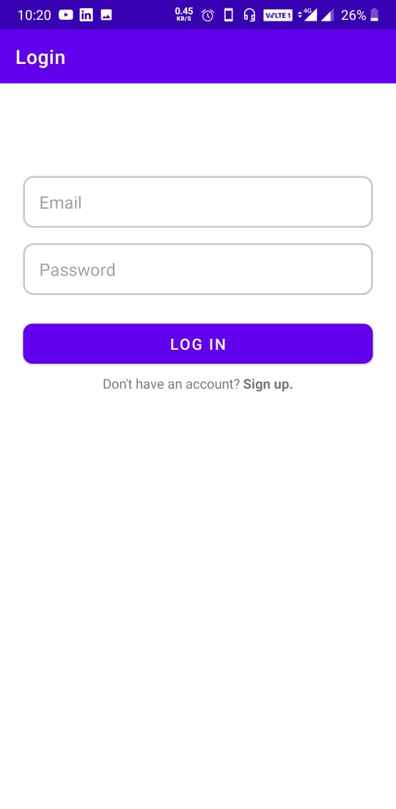
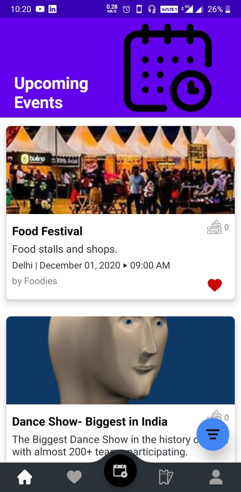
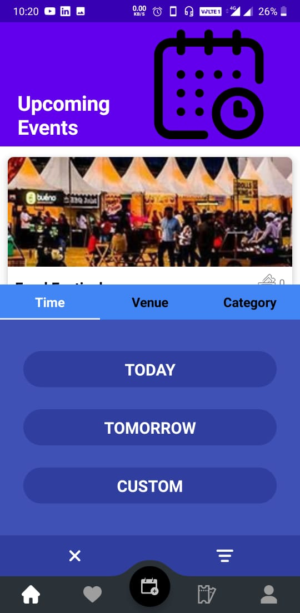
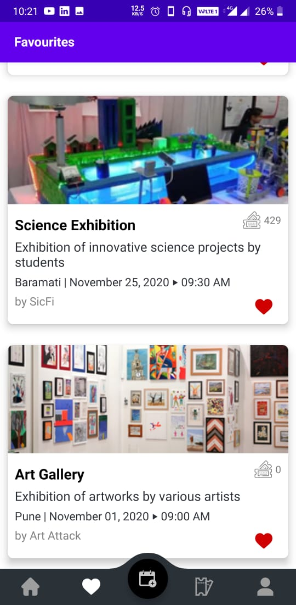
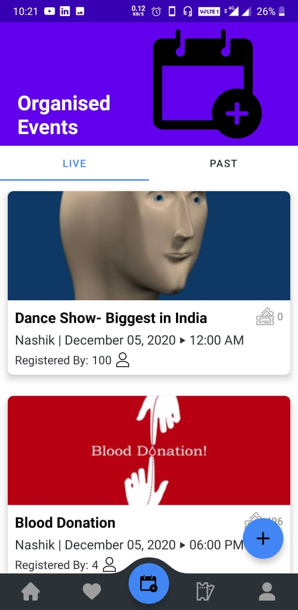
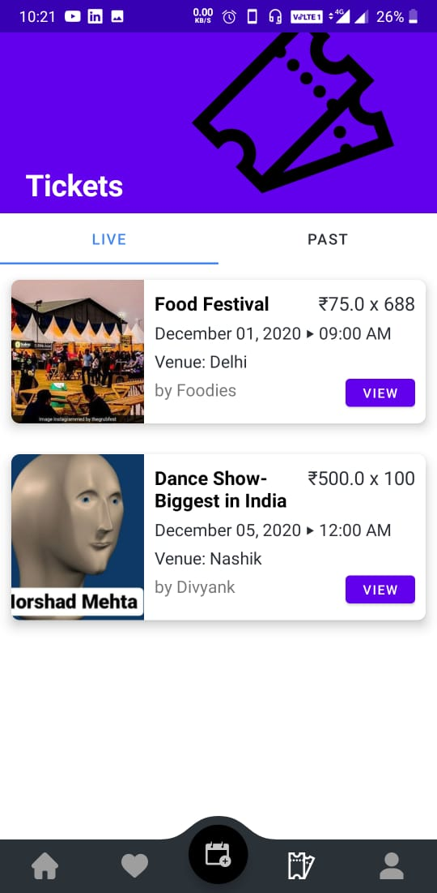
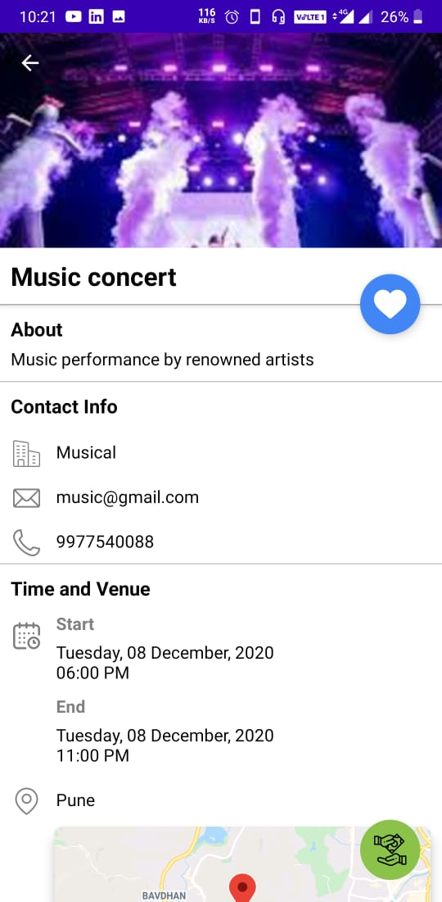
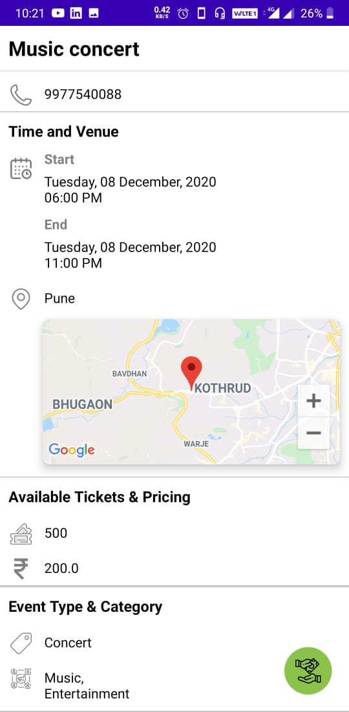

Evento is a native Android application for exploring nearby events hosted. Evento provides all the details about upcoming,present and past events along with pticing and available tickets. The application follows MVVM architecture, written in Java and fetches data from the backend built using NodeJS, Express and MongoDB as database.

## Gallery

|Login Screen|Upcoming Events|Filter Option|
|------|------|------|
||||

|Favourite Events|Organised Events|Booked Events|
|------|------|------|
||||

|Event Description|Event Description|QR Code|
|------|------|------|
||||

## Building The Code

1. Clone the repository using HTTP: `https://github.com/divyank00/Evento.git`
2. Open Android Studio.
3. Click on 'Open an existing Android Studio project'
4. Browse to the directory where you cloned the project, choose frontend and click OK.
5. Let Android Studio import the project and you are good to go!

## Contribution Guidelines

1. All issues should be raised via GitHub issue tracker and should follow the issue template
2. All changes should be proposed via Pull Requests and should follow the pull request template
3. Commit messages should be appropriate and must reflect/describe the changes made
4. _One_ commit should have only _one_ change although it may involve changes in multiple files

## How To Contribute

1. Fork the project
2. Make your changes and push the changes to **your** forked repository
3. Raise a pull-request **dev** branch and ensure the pull request follows the template.
4. At the moment we are adding all the new features to the **dev** branch, and pushing only fully features to our
**master** branch.

## Documentation

- **Language**: Java
- **Architecture**: Model View ViewModel (MVVM)
- **Libraries**: LiveData, ViewModel, [Retrofit](https://github.com/square/retrofit), 
[Material Components](https://github.com/material-components/material-components-android),
[ShimmerRecyclerView](https://github.com/sharish/ShimmerRecyclerView),
[Picasso](https://github.com/square/picasso), [Lottie-Android](https://github.com/airbnb/lottie-android),
[LikeButton](https://github.com/jd-alexander/LikeButton),
[SpaceNavigationView](https://github.com/armcha/Space-Navigation-View)

## Maintainer
- [Divyank Lunkad](https://github.com/divyank00)
